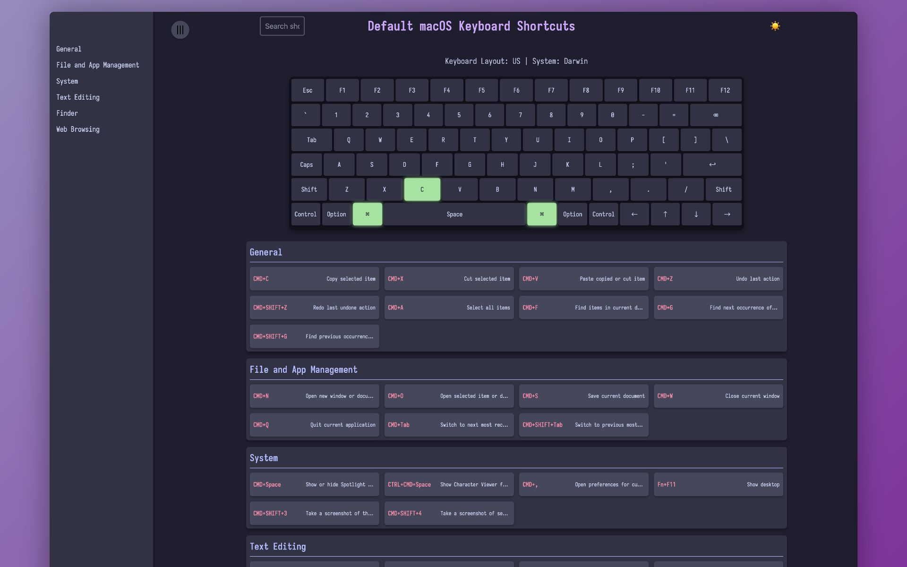

<p align="center">
  
</p>

# KoalaKeys

A simple tool to create and manage portable keyboard shortcut cheat sheets.

> **Demo**: Check out the [live demo](https://rtuszik.github.io/KoalaKeys-Collection/) to see a small collection of cheat sheets created with this project.

## Overview

KoalaKeys generates and organizes portable, interactive HTML cheat sheets for keyboard shortcuts. It's designed for developers, designers, and power users who want to keep their essential shortcuts easily accessible.

> **Quick Start**: To create a cheat sheet, add a YAML file to the `cheatsheets` directory and run `python src/generate_cheatsheet.py`. For detailed YAML formatting instructions, see the [YAML Cheat Sheet Specification Guide](yaml_cheatsheet_spec.md).

## Screenshots

<p align="center">
  
    </a>
</p>

## Features

- Generate HTML cheat sheets from YAML files
- Interactive keyboard layout with real-time highlighting
- Categorized shortcuts with descriptions
- Index page for quick access to all cheat sheets
- Search functionality
- Support for different keyboard layouts and system mappings

## Demo and Examples

A live demo instance is available, showcasing a selection of cheat sheets:

- **Demo Site**: [https://rtuszik.github.io/KoalaKeys-Collection/](https://rtuszik.github.io/KoalaKeys-Collection/)
- **Demo Repository**: [https://github.com/rtuszik/KoalaKeys-Collection](https://github.com/rtuszik/KoalaKeys-Collection)

Explore the demo to see how KoalaKeys works and to get ideas for creating custom cheat sheets. The demo repository also contains example YAML files that can be used as templates for new cheat sheets.

## Available Systems and Keyboards

### Systems

- Darwin (macOS)
- Linux
- Windows

### Keyboard Layouts

- US
- UK
- DE (German)
- FR (French)
- ES (Spanish)
- DVORAK

## Requirements

- Python 3.8+

## Installation

1. Clone the repository:

   ```
   git clone https://github.com/rtuszik/KoalaKeys
   cd KoalaKeys
   ```

2. Create and activate a virtual environment (optional):

   ```
   python -m venv .venv
   source .venv/bin/activate  # On Windows, use `venv\Scripts\activate`
   ```

3. Install dependencies:

   ```
   pip install -r requirements.txt
   ```

4. Set up the output directory:
   Create a `.env` file in the project root with:
   ```
   CHEATSHEET_OUTPUT_DIR=path/to/your/output/directory
   ```

## Usage

1. Create YAML files for your cheat sheets in the `cheatsheets` directory. For detailed instructions on how to format YAML files, please refer to the [YAML Cheat Sheet Specification Guide](yaml_cheatsheet_spec.md).

2. Generate cheat sheets:

   ```
   python src/generate_cheatsheet.py
   ```

3. Find the HTML cheat sheets in the specified output directory.

4. Open `index.html` to view the cheat sheet collection.

## Contributing

Contributions are welcome! Feel free to submit issues, feature requests, or pull requests.

## License

This project is licensed under the terms of the [GPLv3](LICENSE).
